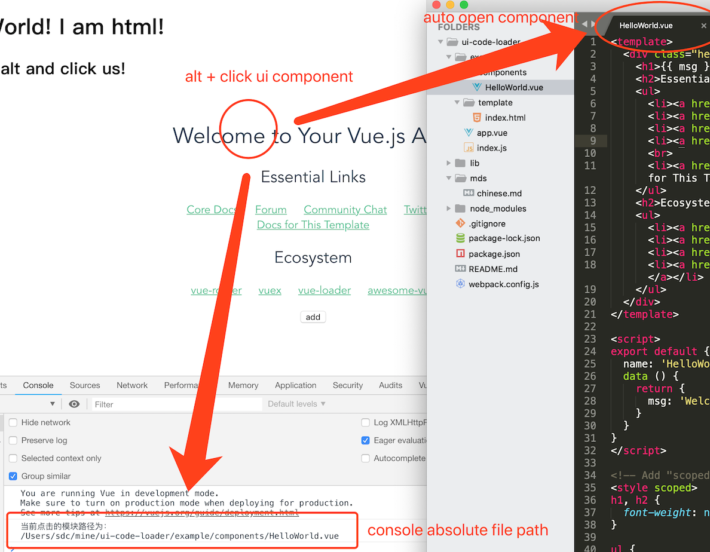

# UI CODE LOADER

\[[English](../README.md)\]



## 简介

前端项目日趋复杂，工程化、组件化，导致`ui`与`代码文件`之间的映射复杂隐晦，降低开发效率。项目越复杂越明显。

试想定位页面的一处ui的代码，可能需要经历理解项目结构，查找入口文件，根据url定位router，按照组件层级一级一级找直至最终文件。

如果你用vue或者html构建项目ui，引入`ui-code-loader`, 只需要按住alt在浏览器上一点，编辑器(默认vscode或者sublime)即可`直接打开ui所在组件`，控制台同时输出`组件绝对路径`。

## 安装

```
npm install ui-code-loader --save-dev
```

## 用法

1. 在本地webpack开发配置中引入`ui-code-loader`

```js
// webpack.dev.config.js
module: {
    rules: [
        {
            test: /\.(vue|html)$/,
            use: [
                {
                    loader: 'ui-code-loader'
                }
            ],
            enforce: 'pre',
            exclude: [path.resolve(__dirname, '../../node_modules')] // better exlude node_modules
        }
    ]
}
```

2. 启动项目，在浏览器中，`按住alt单击`vue组建或者html模块，控制台会打印出模块的绝对路径，vscode或者sublime自动打开相应文件

## 配置

- `idePaths` <Array>: 编辑器绝对路径。 默认顺序： \[...idePaths, '/Applications/Visual\ Studio\ Code.app/Contents/Resources/app/bin/code', '/Applications/Sublime\ Text.app/Contents/SharedSupport/bin/subl'\]

- `isSendReqest`<Boolean>: 是否发送请求打开编辑器，默认True

- `cb`<Function>: 回调函数，参数为选中模块的绝对路径

## 🌰

`npm i && npm run dev`

## 注意事项

> 目前支持html文件和vue文件，可按需配置；

> 出于安全考虑，最好在本地开发环境下才引入本loader；

> 与eslint-loader等配置了enforce: 'pre'的代码检查loader共用，需要保证本loader放置于eslintloader之前

## TODO

- 覆盖更多ui文件类型
- 提供文件依赖分析，定位组件在依赖树中的位置
- 欢迎提供建议
